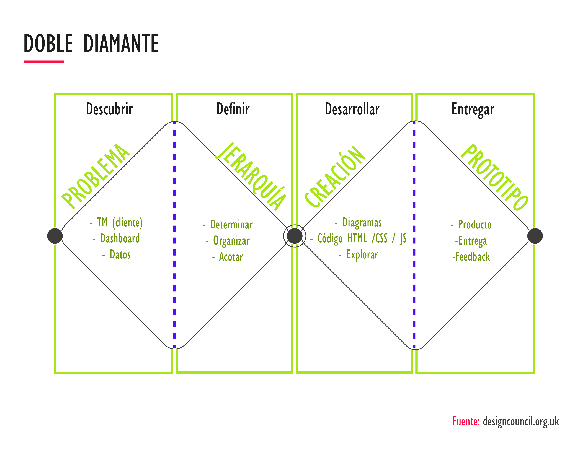
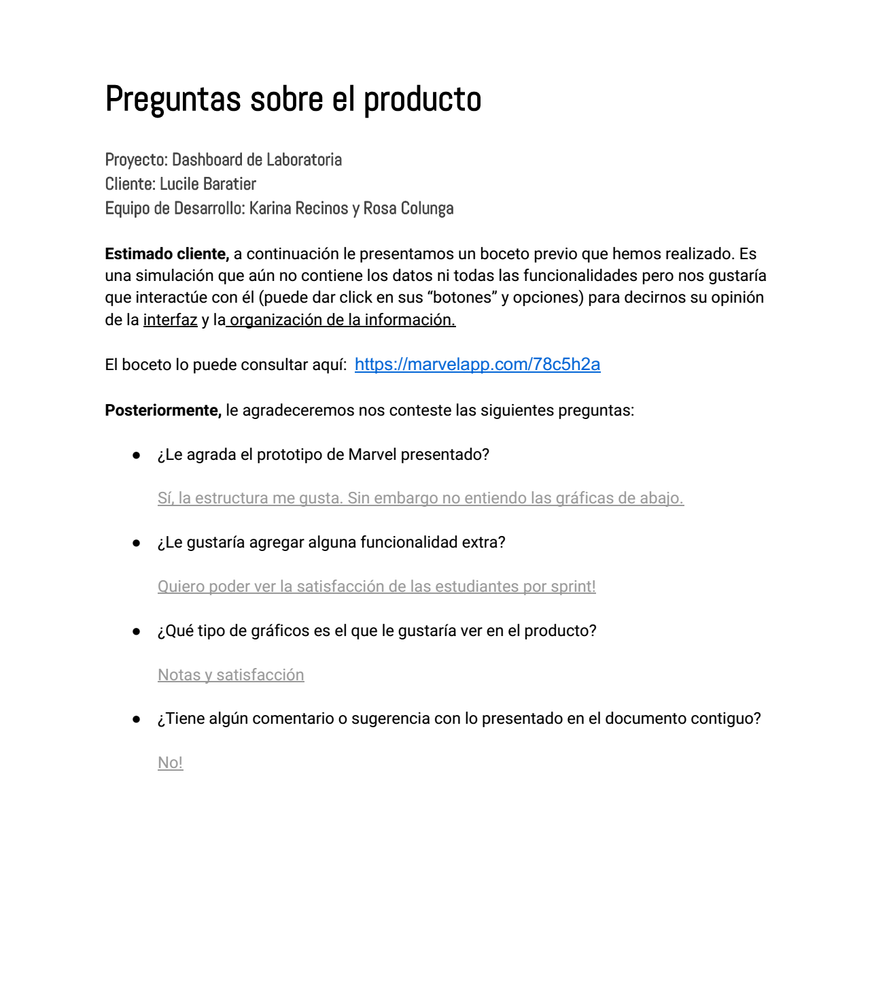
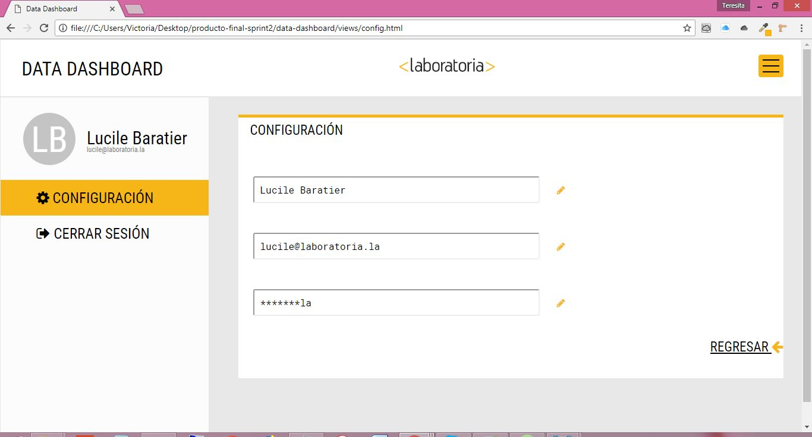
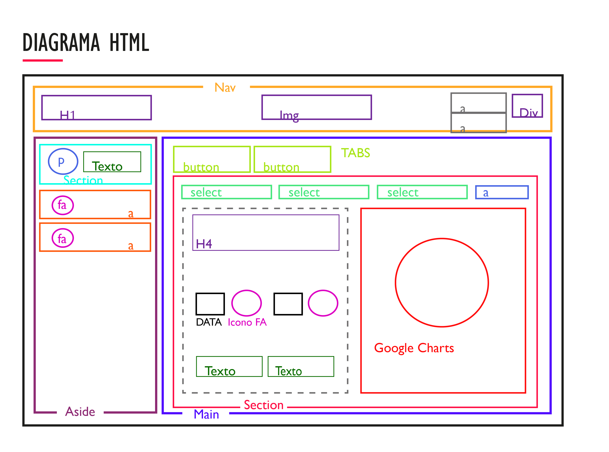

# Data Dashboard

El dashboard de Laboratoria es una herramienta que permite a los usuarios (training managers, teachers, entre otros miembros del staff) ver datos sobre las alumnas y su progreso dentro de Laboratoria.

***

## Proceso
#### Metodología Doble Diamante

En este proyecto trabajaremos una metodología Doble Diamante, la cual consiste en 4 etapas que describimos en un gráfico a continuación:

## Empatía y definición

**Proceso de diseño previo [aquí](https://github.com/rosColunga/retos-ux#3-sketch-para-herramienta-dashboard-de-laboratoria)**

**Prototipo:** https://marvelapp.com/78c5h2

#### Testeo y retroalimentación del cliente
Una vez analizados los requerimientos iniciales del cliente: *Laboratoria*; y habiendo detectado los **pain-points** del usuario *Trainning Managers*: frustración y pérdida de productividad ante la desorganización y alta cantidad de datos. Procedemos a realizar un testing por medio del prototipo creado a través de Marvel App, seguido de ello se realiza una entrevista a Lucile Baratier, la Trainning Manager de la Sede en México, para obtener su feedback.

#### Insights
De dicha entrevista vía y remota y una presencial con el cliente, mostrándole avances de desarrollo, obtuvimos la siguiente información.
- *El uso de gráficas no se considera indispensable.* Nuestra usuaria exclama preferir contar con organización y claridad visualmente en números que por medio de gráficas.
- En caso de presentar datos o fotografías de las alumnas, es *importante contar con un Log-in* para proteger la información.
- Se prefiere *funcionalidad* en mostrar data y filtrar resultados que interactividad compleja o procesos largos.

## Estructura de HTML:

#### Nuestra web esta conformada por **3 secciones** principales:

  1. **El _Nav_**: Menú de navegación principal. Elemento de texto del lado izquierdo con el título de la página web. Centrado el identificador (logo) de Laboratoria. Flotado del lado derecho, un menú hamburguesa con utilidades desplegables: Idioma / Log-out

  2. **El menú lateral _Aside_**: Sección donde se encuentran los datos generales del usuario (nombre, correo electrónico, foto de perfil). En la parte inferior dos secciones: **Configuración**; que vincula a una vista contenida dentro de la estructura de carpetas _(views/config.html)_ que captura los datos como se muestra a continuación.

  

  Cerrar sesión; enlace que al dar click vinculará en la home page de www.laboratoria.la

  3. **La sección principal _Main_**: Sección que funciona con 2 visualizaciones por medio de Tabs.
  - **"INFORMACIÓN":** despliega por medio de 2 _<select_> los datos (Data vinculada desde _Javascript_), por Ciudades y por Generaciones.
A un costado de los _select_, tenemos un vínculo _<a_> _"VER PROFESORES"_ que nos lleva a la parte del documento en que se muestran los puntajes dados a Profesores y Jedi.

 - **"ESTUDIANTES":** Pestaña en la cual tenemos una visualización de los datos generales de las alumnas. Igualmente se despliega por medio de 2 _<select_> por generación y ciudad, y un vínculo _<a_> _"VER PROFESORES"_ que nos lleva a la parte del documento en que se muestran los perfiles de Profesores y Jedi.

## Desarrollo del proyecto

Para este producto final se deberá analizar la problemática que presenta un Trainning Manager de Laboratoria por lo que se debe de tener en cuenta todos los datos con los que ellos trabajan.

**Primero**

Se realizará el maquetado del proyecto una vez que haya sido aceptado por el cliente, con los estilos adecuados que maneja Laboratoria y con el material incluido en el repositorio

**Posteriormente**

En cuanto al JS se realizará el siguiente proceso:

1. Se declararán todas la variables necesarias para el proyecto(datos solicitados por el cliente)
2. Realizar una función que incluya los datos de CDMX
3. Con esta crearemos los procesos para sacar los datos de alumnas por generación
4. También crearemos funciones para saber el total de alumans que siguen estudiando en Laboratoria
5. Estas funciones las reutilizaremos para cada una de las sedes y generaciones existentes en Laboratoria

**Por último**

Se anexará la parate de maquetado con la de funcionalidad para que el producto funcione adecuadamente y así poder presentarlo al cliente.

## Diagrama de flujo

## Organización del trabajo en equipo

**Proceso y metodología de diseño, maquetación:** Rosa Talía Colunga Tello

**Manejo de Data y funcionalidad:** Brenda Karina Recinos Quezada

Para el desarrollo del proyecto el equipo utilizo diferentes herramientas de comunicación como lo es Hangouts y Whatsapp, para mantener contacto entre los miembros de este.

Mientras que con el cliente se mantuvo comunicación mediante un canal en Slack y se compartieron las dudas con documentos de Google Drive, el cliente también pudo ver como el equipo avanzaba en el desarrollo del producto mediante un tablero de Trello; donde el equipo actualizaba sus avances, este se puede consultar a traves del siguiente enlace:

https://trello.com/b/3T7Dp9d2/producto-final

